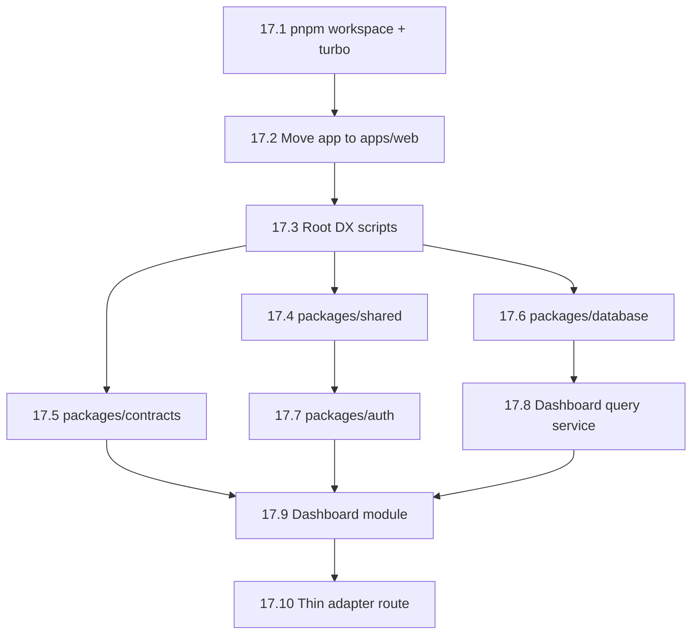

# Epic 17: Monorepo Backend Architecture

## Overview

Restructure the english_learning_app from a flat Next.js project into a monorepo with clean backend boundaries. Business logic moves out of `app/api/*` route handlers into reusable domain packages. Route handlers become thin HTTP adapters. Shared contracts enable future mobile support.

**Source Spec:** `docs/superpowers/specs/2026-04-15-monorepo-ready-backend-design.md`

## Goals

- Establish monorepo workspace structure (pnpm workspaces)
- Move current app into `apps/web/`
- Create foundational packages: `contracts`, `shared`, `database`, `auth`
- Extract dashboard module as proof-of-concept for the adapter → use case → repo pattern
- All existing features continue working without regression

## Non-Goals (This Epic)

- Extracting ALL modules (vocabulary, chat, reading, etc.) — future epics
- Creating `apps/api` standalone service
- Mobile app or bearer token auth
- OpenAPI generation from contracts

---

## Sprint R1: Monorepo Scaffolding (2 days)

### Story 17.1 — Initialize pnpm Workspace + Turborepo

**As a** developer,
**I want** the project configured as a pnpm workspace with Turborepo,
**so that** packages can be developed and built independently with proper dependency resolution.

**Acceptance Criteria:**

- [ ] `pnpm-workspace.yaml` created with `apps/*` and `packages/*`
- [ ] `turbo.json` created with `build`, `dev`, `lint`, `test` pipelines
- [ ] Root `package.json` updated with workspace scripts
- [ ] `pnpm install` succeeds from project root
- [ ] `pnpm build` succeeds (even if only the web app exists)

**Technical Notes:**

- Use `pnpm` (already the project's package manager)
- Turborepo for build orchestration and caching
- Root `tsconfig.json` becomes a base config; each package/app extends it

---

### Story 17.2 — Move Current App to `apps/web/`

**As a** developer,
**I want** the existing Next.js app moved into `apps/web/`,
**so that** the monorepo has room for shared packages and future apps.

**Acceptance Criteria:**

- [ ] All source files moved to `apps/web/` (app/, components/, hooks/, lib/, data/, public/, styles/)
- [ ] `apps/web/package.json` created with the app's dependencies
- [ ] `apps/web/tsconfig.json` extends root tsconfig with correct path aliases
- [ ] `apps/web/next.config.ts` updated for monorepo (transpilePackages for workspace packages)
- [ ] All `@/*` import aliases resolve correctly from `apps/web/`
- [ ] `pnpm dev --filter web` starts the dev server
- [ ] `pnpm build --filter web` succeeds
- [ ] All existing tests pass
- [ ] Drizzle config updated — `drizzle-kit generate` and `drizzle-kit migrate` still work
- [ ] No feature regression (manual smoke test: home, dictionary, flashcards, chat)

**Technical Notes:**

- This is the highest-risk story. No other changes should be in the same PR.
- Update `.env.local` path references if needed.
- Move `drizzle.config.ts` to `apps/web/` or keep at root with updated paths.
- Keep `data/english-words.txt` accessible (update `nearby-words.ts` path resolution).

**Risk:** High — every import path changes. Dedicated PR, no feature work mixed in.

---

### Story 17.3 — Root Developer Experience Setup

**As a** developer,
**I want** root-level scripts for common tasks,
**so that** I can run dev/build/test/lint from the monorepo root.

**Acceptance Criteria:**

- [ ] `pnpm dev` from root starts web app
- [ ] `pnpm build` from root builds all packages + web app
- [ ] `pnpm lint` from root lints all packages + web app
- [ ] `pnpm test` from root runs all tests
- [ ] `pnpm db:generate` and `pnpm db:migrate` work from root
- [ ] `.gitignore` updated for monorepo (node_modules in each package, turbo cache)
- [ ] README updated with monorepo development instructions

---

## Sprint R2: Shared Packages (2–3 days)

### Story 17.4 — Create `packages/shared` (Error Types + Result Helpers)

**As a** developer,
**I want** a shared utilities package with typed errors and result helpers,
**so that** all backend modules use consistent error handling patterns.

**Acceptance Criteria:**

- [ ] `packages/shared/package.json` created with name `@repo/shared`
- [ ] `packages/shared/tsconfig.json` extends root config
- [ ] Error classes created: `AppError` (base), `ValidationError`, `UnauthorizedError`, `ForbiddenError`, `NotFoundError`, `ConflictError`, `IntegrationError`
- [ ] Each error has: `code` (string enum), `message`, `statusCode` (HTTP mapping)
- [ ] `Result<T, E>` type helper created for use-case return values
- [ ] `packages/shared/src/index.ts` exports all public API
- [ ] Unit tests for error classes
- [ ] Package builds successfully
- [ ] Web app can import from `@repo/shared`

**Technical Notes:**

```ts
// Example error shape
export class NotFoundError extends AppError {
  constructor(entity: string, id: string) {
    super(`${entity} not found: ${id}`, "NOT_FOUND", 404);
  }
}
```

---

### Story 17.5 — Create `packages/contracts` (Zod Schemas + DTOs)

**As a** developer,
**I want** a contracts package that defines API request/response shapes with zod,
**so that** web, mobile, and backend modules share the same type definitions.

**Acceptance Criteria:**

- [ ] `packages/contracts/package.json` created with name `@repo/contracts`
- [ ] `zod` added as dependency
- [ ] Dashboard contracts created:
  - `DashboardResponseSchema` (matches current `/api/dashboard` response shape)
- [ ] Common contracts created:
  - `PaginationSchema` (offset, limit)
  - `ApiErrorResponseSchema` (code, message)
- [ ] TypeScript types derived from zod schemas (`z.infer<typeof ...>`)
- [ ] `packages/contracts/src/index.ts` exports all schemas and types
- [ ] Unit tests validate schema parsing
- [ ] Web app can import from `@repo/contracts`

**Technical Notes:**

- Extract current response shapes from `app/api/dashboard/route.ts` into zod schemas
- Don't change the actual API response yet — just codify what already exists

---

### Story 17.6 — Create `packages/database` (Schema + Client Extraction)

**As a** developer,
**I want** the Drizzle schema and DB client extracted into a shared database package,
**so that** modules and apps can share the same schema without importing from `lib/db`.

**Acceptance Criteria:**

- [ ] `packages/database/package.json` created with name `@repo/database`
- [ ] `packages/database/src/schema/` contains all tables (moved from `lib/db/schema.ts`)
- [ ] `packages/database/src/client/` contains DB client setup (moved from `lib/db/index.ts`)
- [ ] `packages/database/src/index.ts` re-exports schema and client
- [ ] All `apps/web` imports updated from `@/lib/db` → `@repo/database`
- [ ] Drizzle config updated to reference `packages/database/src/schema`
- [ ] `drizzle-kit generate` works
- [ ] `drizzle-kit migrate` works
- [ ] All existing tests pass
- [ ] No feature regression

**Technical Notes:**

- This is a large mechanical refactor (every API route and many hooks import from `@/lib/db`)
- Use find-and-replace: `from "@/lib/db/schema"` → `from "@repo/database"`
- Keep `lib/db/` as a re-export barrel for backward compatibility during transition if needed
- Migrations folder stays at root (or moves to `packages/database/migrations/`)

**Risk:** Medium — many files change, but changes are mechanical (import paths only).

---

### Story 17.7 — Create `packages/auth` (ActorContext Abstraction)

**As a** developer,
**I want** an auth package that provides an `ActorContext` type and web session resolver,
**so that** business modules receive a framework-agnostic identity instead of depending on `next/headers`.

**Acceptance Criteria:**

- [ ] `packages/auth/package.json` created with name `@repo/auth`
- [ ] `ActorContext` type defined:
  ```ts
  type ActorContext = {
    userId: string;
    roles: string[];
    clientType: "web" | "mobile" | "internal";
  };
  ```
- [ ] `resolveWebActor(req)` function created — wraps current `auth.api.getSession({ headers })` pattern
- [ ] Returns `ActorContext` on success, throws `UnauthorizedError` on failure
- [ ] Unit tests with mocked auth
- [ ] Web app can import from `@repo/auth`
- [ ] At least one route handler updated to use `resolveWebActor()` as proof of concept

**Technical Notes:**

- The 30+ existing routes still use inline `auth.api.getSession()`. This story creates the abstraction; later stories adopt it route-by-route.
- `resolveWebActor` lives in `packages/auth/src/web/` — future `resolveTokenActor` for mobile would live in `packages/auth/src/token/`.

---

## Sprint R3: Dashboard Module Extraction (2 days)

### Story 17.8 — Create Dashboard Query Service in `packages/database`

**As a** developer,
**I want** the dashboard aggregation query extracted into a dedicated query service,
**so that** the dashboard use case can call it without knowing about Drizzle internals.

**Acceptance Criteria:**

- [ ] `packages/database/src/queries/dashboard-query-service.ts` created
- [ ] `DashboardQueryService` interface defined in `packages/database/src/queries/`
- [ ] Implementation extracts current query logic from `app/api/dashboard/route.ts`
- [ ] Returns typed result matching `DashboardResponseSchema` from `@repo/contracts`
- [ ] Integration test with test DB verifies query returns correct shape
- [ ] No changes to API response behavior

**Technical Notes:**

- The current dashboard route does: auth → 6+ DB queries → aggregate → return JSON
- Extract the "6+ DB queries → aggregate" part into this service
- The service receives `userId: string` and returns the aggregated data

---

### Story 17.9 — Create Dashboard Module in `packages/modules`

**As a** developer,
**I want** a dashboard domain module with a `getDashboardOverview` use case,
**so that** the route handler becomes a thin adapter that delegates to the module.

**Acceptance Criteria:**

- [ ] `packages/modules/package.json` created with name `@repo/modules`
- [ ] `packages/modules/src/dashboard/application/get-dashboard-overview.ts` created
- [ ] Use case accepts `{ actor: ActorContext, dashboardQuery: DashboardQueryService }`
- [ ] Use case returns typed response matching `@repo/contracts` dashboard schema
- [ ] Use case contains NO imports from `next/*`, `drizzle-orm`, or `@/lib/*`
- [ ] Unit test with fake query service
- [ ] Module builds independently

**Technical Notes:**

```ts
// packages/modules/src/dashboard/application/get-dashboard-overview.ts
export async function getDashboardOverview(deps: {
  actor: ActorContext;
  dashboardQuery: DashboardQueryService;
}): Promise<DashboardOverviewResponse> {
  return deps.dashboardQuery.getOverviewForUser(deps.actor.userId);
}
```

Dashboard is intentionally simple — it's read-only with no complex business rules. This makes it the ideal first module to prove the pattern.

---

### Story 17.10 — Refactor Dashboard Route to Thin Adapter

**As a** developer,
**I want** the `GET /api/dashboard` route handler refactored to a thin adapter,
**so that** it only does: validate → resolve actor → call use case → return response.

**Acceptance Criteria:**

- [ ] `apps/web/app/api/dashboard/route.ts` refactored to:
  1. Call `resolveWebActor(req)` from `@repo/auth`
  2. Call `getDashboardOverview()` from `@repo/modules`
  3. Return `Response.json(result)`
- [ ] Route handler is ≤ 15 lines of code
- [ ] Response body is identical to current response (no breaking changes)
- [ ] `DashboardProvider` context on the frontend works unchanged
- [ ] Performance: response time within ±50ms of current
- [ ] All dashboard-related tests pass

**Technical Notes:**

```ts
// Target shape
export async function GET(req: Request) {
  const actor = await resolveWebActor(req);
  const result = await getDashboardOverview({
    actor,
    dashboardQuery: drizzleDashboardQueryService,
  });
  return Response.json(result);
}
```

This is the culmination story — if this works, the pattern is proven and can be applied to vocabulary, chat, reading, etc. in future sprints.

---

## Story Dependency Graph



## Sprint Summary

| Sprint | Stories | Days | Risk |
|--------|---------|------|------|
| **R1: Scaffolding** | 17.1, 17.2, 17.3 | 2 | 🔴 High (import paths) |
| **R2: Shared Packages** | 17.4, 17.5, 17.6, 17.7 | 2–3 | 🟡 Medium (mechanical refactor) |
| **R3: Dashboard Module** | 17.8, 17.9, 17.10 | 2 | 🟢 Low (pattern proof) |

## Future Epics (Not Scoped Yet)

- **Epic 18:** Vocabulary module extraction (write-heavy, ports + repos)
- **Epic 19:** Chat module extraction (streaming, OpenAI integration)
- **Epic 20:** Reading module extraction (Guardian API, grammar analysis)
- **Epic 21:** Mobile-ready API boundary (bearer auth, response envelopes)
- **Epic 22:** Standalone API extraction (`apps/api`)
