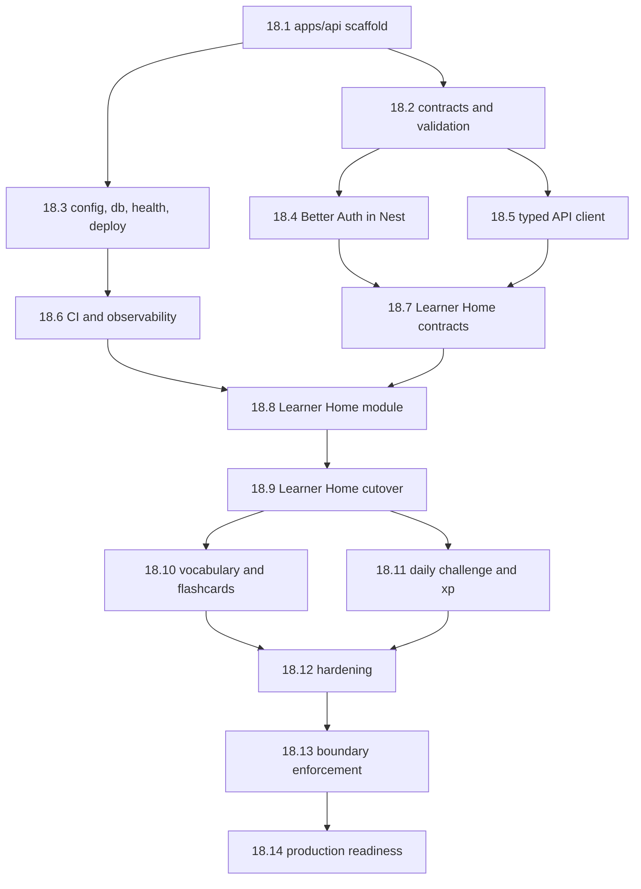

# Epic 18: NestJS Backend Platform and API Migration

Detailed implementation-ready child stories are tracked in `epic-18-nestjs-backend-migration-stories.md`.

## Overview

Adopt NestJS as the authoritative backend in `apps/api` and migrate the current Next.js API surface toward a modular-monolith backend. The goal is not to add another server layer. The goal is to make backend ownership explicit, keep `apps/web` focused on UI and SSR, and create a contract-first API boundary that can support future clients without turning `apps/web` into a long-term backend host.

This epic assumes the monorepo foundation from Epic 17 Sprint R1-R2 is already in place:

- `pnpm` workspace + Turborepo
- `apps/web`
- `packages/shared`
- `packages/contracts`
- `packages/database`
- `packages/auth`

This epic does **not** assume Epic 17 Sprint R3 must finish first. If Epic 18 is approved, any remaining extraction work from `apps/web/app/api/*` should be implemented in `apps/api` modules rather than expanding the long-term responsibility of Next route handlers.

## Source Inputs

- Current repo structure as of 2026-04-16
- Existing backend routes under `apps/web/app/api/*`
- Existing shared packages in `packages/*`
- Roundtable recommendations from Winston, John, Amelia, and Bob on 2026-04-16

## Goals

- Create `apps/api` as the single authoritative backend service
- Keep `apps/web` as UI + SSR + client integration, not business-logic ownership
- Reuse `@repo/contracts`, `@repo/database`, and `@repo/auth` as the shared backend foundation
- Standardize on REST + Zod-first contracts for API boundaries
- Prove the migration with one production vertical slice before broader cutover
- Preserve current product behavior while migrating incrementally

## Non-Goals

- Big-bang rewrite of all backend logic
- Microservices, event buses, CQRS, or GraphQL in this phase
- Replacing Drizzle ORM or PostgreSQL
- Replacing Better Auth as the auth system of record
- Migrating all AI-heavy routes (`chat`, `reading`, `writing`, `listening`, `voice`) in the first delivery wave
- Mobile bearer-token support unless a real client requires it during this epic

## Architecture Decisions Locked by This Epic

- `apps/api` owns controllers, services, guards, validation, orchestration, and integration logic
- `apps/web` consumes backend capabilities through typed HTTP clients and does not own core backend logic for migrated domains
- `packages/contracts` remains framework-agnostic and is the source of truth for request/response/error schemas
- `packages/database` remains the only home for Drizzle schema and DB primitives
- `packages/auth` remains the home for shared auth/session primitives, with Nest-specific adapters added there or under `apps/api/src/modules/auth`
- NestJS stays a modular monolith in this phase

## First Vertical Slice Recommendation

The first production slice should be the **Learner Home** domain because it exercises auth, DB reads, DB writes, typed contracts, and frontend integration without the volatility of the AI routes.

**Initial scope for Learner Home:**

- `apps/web/app/api/dashboard/route.ts`
- `apps/web/app/api/preferences/route.ts`
- `apps/web/app/api/learning-style/route.ts`
- `apps/web/app/api/xp/route.ts`

This gives the migration one read-heavy flow (`dashboard`, `xp`) and one preference-oriented flow (`preferences`, `learning-style`) without coupling phase 1 to OpenAI, audio, or content-generation pipelines.

## Sprint R4: API Foundation (1 week)

### Story 18.1 - Create `apps/api` NestJS Application

**As a** developer,  
**I want** a NestJS app scaffolded inside the monorepo,  
**so that** backend work has a dedicated service boundary instead of continuing inside `apps/web`.

**Acceptance Criteria:**

- [ ] `apps/api/` exists with `package.json`, `tsconfig.json`, `src/main.ts`, and Nest bootstrap files
- [ ] Root `pnpm dev`, `pnpm build`, `pnpm lint`, and `pnpm test` can include the API app through Turbo
- [ ] `pnpm dev --filter api` starts the Nest service locally
- [ ] `pnpm build --filter api` succeeds
- [ ] API app uses the existing workspace TypeScript base config
- [ ] No changes are required to keep `apps/web` running during this setup

**Technical Notes:**

- Use a plain NestJS HTTP app, not microservice mode
- Keep the first module set minimal: app, health, config, auth placeholder

---

### Story 18.2 - Establish API Contracts, Validation, and Error Envelope

**As a** developer,  
**I want** a contract-first API boundary for NestJS,  
**so that** web and backend share one transport definition and do not drift.

**Acceptance Criteria:**

- [ ] Contract conventions documented for `@repo/contracts/src/http/*`
- [ ] API request/response/error schemas are defined with Zod in `@repo/contracts`
- [ ] Nest request validation is wired to those Zod schemas
- [ ] A standard API error envelope exists and is used by Nest exception handling
- [ ] No `class-validator` duplication is introduced for the same transport contract
- [ ] At least one sample endpoint proves schema validation + error shaping end-to-end

**Technical Notes:**

- Keep contracts framework-agnostic
- Nest adapts to contracts; contracts do not depend on Nest

---

### Story 18.3 - Wire Config, Database, Health, and Deployment Baseline

**As a** developer,  
**I want** the API connected to config, DB, and deployment primitives,  
**so that** the service is production-viable from the start.

**Acceptance Criteria:**

- [ ] Nest config loading is in place for local and deployed environments
- [ ] `@repo/database` is consumed through Nest DI without schema duplication
- [ ] `/health` and `/ready` endpoints exist
- [ ] A deployment target is chosen and documented for `apps/api`
- [ ] Local `web + api + db` startup is documented and works
- [ ] Structured request logging is enabled for the API baseline

**Technical Notes:**

- Prefer reverse proxying under one top-level domain if cookie/session simplicity matters
- Do not introduce queues or workers in this story

---

## Sprint R5: Auth and Client Integration Baseline (1 week)

### Story 18.4 - Integrate Better Auth Session Resolution in NestJS

**As a** developer,  
**I want** NestJS to resolve the current user via Better Auth,  
**so that** migrated endpoints can enforce auth and authorization consistently.

**Acceptance Criteria:**

- [ ] Nest guard or middleware resolves the current actor from Better Auth session state
- [ ] `@repo/auth` remains the shared auth foundation
- [ ] Authenticated and unauthenticated request flows are covered by tests
- [ ] Cookie, CORS, and proxy/domain assumptions are documented
- [ ] A `/me` or equivalent authenticated endpoint proves session resolution end-to-end

**Technical Notes:**

- Do not rewrite auth from scratch
- Decide early whether this epic is session/cookie only or also needs bearer token support

---

### Story 18.5 - Create Typed API Client and Web Integration Strategy

**As a** developer,  
**I want** `apps/web` to call `apps/api` through typed clients,  
**so that** frontend code does not hardcode endpoint strings or contract assumptions.

**Acceptance Criteria:**

- [ ] A typed fetch client exists under `@repo/contracts` or a dedicated sibling package
- [ ] `apps/web` can call `apps/api` through an environment-driven base URL
- [ ] Shared auth/cookie behavior is compatible with the chosen proxy strategy
- [ ] Web integration patterns are documented for server components, client components, and SSR loaders
- [ ] At least one endpoint is consumed from `apps/web` through the typed client

**Technical Notes:**

- Avoid handwritten endpoint strings in feature code
- Keep client wrappers thin and transport-focused

---

### Story 18.6 - Add API CI, Test Harness, and Observability Baseline

**As a** developer,  
**I want** the API to have CI, unit tests, e2e tests, and baseline telemetry,  
**so that** migration work can ship without blind spots.

**Acceptance Criteria:**

- [ ] API build, lint, typecheck, unit test, and e2e test jobs run in CI
- [ ] `supertest` or equivalent e2e harness exists for the Nest app
- [ ] Unit tests cover at least one controller, one service, and one auth guard
- [ ] Basic metrics/logging/error-reporting hooks are documented
- [ ] Failure responses are asserted in tests, not just happy paths

**Technical Notes:**

- Every later migration story depends on this harness
- Keep observability lightweight but real

---

## Sprint R6: First Vertical Slice - Learner Home (2 weeks)

### Story 18.7 - Add Learner Home Contracts

**As a** developer,  
**I want** explicit contracts for the first migrated domain,  
**so that** the first production slice can be built contract-first.

**Acceptance Criteria:**

- [ ] `@repo/contracts` includes schemas/types for Learner Home endpoints
- [ ] Contracts cover `dashboard`, `preferences`, `learning-style`, and `xp` responses as needed
- [ ] Shared API error cases are codified for the Learner Home domain
- [ ] Contract tests validate parsing for success and failure cases
- [ ] Existing dashboard contracts are reused or extended instead of duplicated

---

### Story 18.8 - Implement Learner Home Module in NestJS

**As a** learner,  
**I want** dashboard and preference flows served by the NestJS backend,  
**so that** the new API boundary is proven with a real user workflow.

**Acceptance Criteria:**

- [ ] Nest modules/controllers/services exist for the Learner Home domain
- [ ] Current logic from:
  - [ ] `apps/web/app/api/dashboard/route.ts`
  - [ ] `apps/web/app/api/preferences/route.ts`
  - [ ] `apps/web/app/api/learning-style/route.ts`
  - [ ] `apps/web/app/api/xp/route.ts`
  is moved to API-owned services or adapters
- [ ] DB access flows through `@repo/database`
- [ ] Auth and authorization are enforced by Nest guards/interceptors
- [ ] Unit + integration + e2e tests cover success, validation failure, and unauthorized cases

**Technical Notes:**

- Keep the module boring and explicit
- No direct OpenAI dependencies in this first production slice

---

### Story 18.9 - Cut `apps/web` Over to the Learner Home API

**As a** developer,  
**I want** the web app to consume Learner Home data from `apps/api`,  
**so that** the first migrated slice is truly API-owned.

**Acceptance Criteria:**

- [ ] `apps/web` uses the typed API client for Learner Home flows
- [ ] Old Next route handlers for migrated Learner Home endpoints are removed or reduced to temporary proxies
- [ ] No duplicated business logic remains between `apps/web` and `apps/api` for this slice
- [ ] Existing UI behavior remains unchanged from the user perspective
- [ ] Regression tests or smoke checks confirm no auth/session breakage

---

## Sprint R7: Core Learning Domain Migration (2 weeks)

### Story 18.10 - Migrate Vocabulary and Flashcard Endpoints

**As a** learner,  
**I want** vocabulary and flashcard APIs served from the NestJS backend,  
**so that** core learning loops stop depending on Next route handlers.

**Acceptance Criteria:**

- [ ] Contracts exist for vocabulary and flashcard endpoints
- [ ] Current logic from relevant `vocabulary/*` and `flashcards/*` routes is moved behind Nest modules
- [ ] Review/due flows preserve current behavior and persistence rules
- [ ] Web clients switch to typed API calls for migrated routes
- [ ] Tests cover due items, review submission, and error paths

**Technical Notes:**

- This is the first high-frequency learning loop; performance must be observed

---

### Story 18.11 - Migrate Daily Challenge and XP/Progress Orchestration

**As a** learner,  
**I want** daily challenge completion and XP updates to be API-owned,  
**so that** progress logic is centralized and consistent.

**Acceptance Criteria:**

- [ ] Daily challenge submission and retrieval flows are served by Nest modules
- [ ] XP/progress updates happen in one backend-owned orchestration path
- [ ] Transaction boundaries are explicit where multiple records update together
- [ ] Contracts reflect the current success/failure shapes
- [ ] Tests cover completion, repeat submission, and failure recovery paths

**Technical Notes:**

- Do not move background jobs into this story unless required by the domain

---

### Story 18.12 - Harden the Migrated API Surface

**As a** developer,  
**I want** migrated modules to have core production safeguards,  
**so that** the API is safe to expand.

**Acceptance Criteria:**

- [ ] Rate limiting is in place for migrated public endpoints where appropriate
- [ ] Structured logs and request correlation are available for migrated modules
- [ ] API docs exist for migrated routes
- [ ] Error monitoring covers migrated modules
- [ ] Security middleware and headers are documented and applied where relevant

---

## Sprint R8: Cutover and Governance (1 week)

### Story 18.13 - Enforce the Backend Boundary and Retire Migrated Next Routes

**As a** team,  
**I want** migrated backend ownership enforced in code and workflow,  
**so that** the repo does not drift back into a split-backend model.

**Acceptance Criteria:**

- [ ] Migrated Next route handlers are removed or explicitly marked as temporary proxies with owners and dates
- [ ] New backend feature work is directed to `apps/api` by convention and documentation
- [ ] `apps/web` no longer accesses DB primitives directly for migrated domains
- [ ] Code review guidance exists for backend boundary enforcement
- [ ] Remaining non-migrated route groups are inventoried and prioritized

---

### Story 18.14 - Production Readiness Review and Next-Wave Backlog

**As a** team lead,  
**I want** a cutover scorecard and next-wave plan,  
**so that** the NestJS migration stays measurable instead of open-ended.

**Acceptance Criteria:**

- [ ] Production readiness review completed for migrated domains
- [ ] Rollback and incident response playbook documented for `apps/api`
- [ ] Performance and error baselines captured for migrated flows
- [ ] A next-wave backlog exists for AI-heavy route groups such as:
  - [ ] `chat`
  - [ ] `writing-practice`
  - [ ] `grammar-quiz`
  - [ ] `reading`
  - [ ] `listening`
  - [ ] `voice`
- [ ] Continue / pause / expand decision is made for the next migration wave

---

## Story Definition of Done

A story in this epic is done only if:

- the contract exists in `@repo/contracts` where applicable
- controller/service/repository tests pass
- e2e covers auth, validation, success, and failure for touched endpoints
- `apps/web` is switched to the new API path for migrated flows
- old route ownership is removed, proxied temporarily, or explicitly deprecated with an owner and target date
- CI is green across the monorepo

## Backlog Impact on Epic 17

- Stories `17.8` and `17.9` can still be useful if their extraction work is implemented inside Nest modules or shared packages
- Story `17.10` should not introduce new long-term business logic into `apps/web/app/api/dashboard/route.ts` once Epic 18 begins
- Keep Epic 17 tracking unchanged until the team explicitly reprioritizes the active sprint plan

## Recommended Story Sequence

1. `18.1` Create `apps/api`
2. `18.2` Contracts + validation + error envelope
3. `18.3` Config + DB + health + deployment baseline
4. `18.4` Better Auth integration
5. `18.5` Typed client + web integration strategy
6. `18.6` CI + e2e + observability baseline
7. `18.7` Learner Home contracts
8. `18.8` Learner Home Nest module
9. `18.9` Learner Home cutover in `apps/web`
10. `18.10` Vocabulary + flashcards
11. `18.11` Daily challenge + XP
12. `18.12` Hardening
13. `18.13` Boundary enforcement
14. `18.14` Production readiness + next-wave backlog

## Dependency Graph

